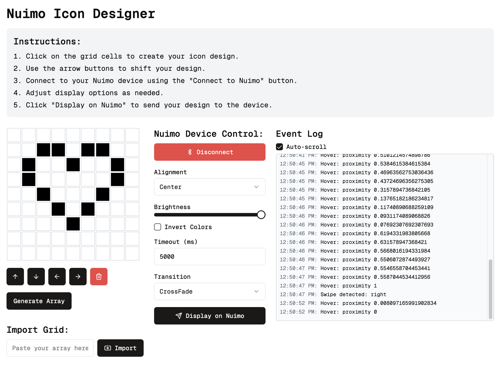

# Nuimo Icon Designer

Nuimo Icon Designer is a web application that allows users to create and display custom icons on their Nuimo Control device. This project uses a React frontend with Next.js and a Node.js backend, communicating via WebSockets for real-time interaction with the Nuimo device.



## Features

- Interactive 9x9 grid for designing icons
- Real-time preview of the designed icon
- Controls for manipulating the icon (shift up, down, left, right)
- Generation of icon arrays for easy sharing and importing
- Direct connection to Nuimo Control device
- Customizable display options (brightness, transition, composition mode, etc.)
- WebSocket communication for real-time updates

## Technology Stack

- Frontend: React, Next.js, TypeScript
- Backend: Node.js, Express, WebSocket
- Monorepo Management: Turborepo
- Package Manager: pnpm
- Nuimo Integration: rocket-nuimo library

## Prerequisites

Before you begin, ensure you have the following installed:

- Node.js (v14 or later)
- pnpm
- A Nuimo Control device

## Setup

1. Clone the repository:

   ```
   git clone https://github.com/yourusername/nuimo-icon-designer.git
   cd nuimo-icon-designer
   ```

2. Install dependencies:

   ```
   pnpm install
   ```

3. Create a `.env` file in the root directory and add any necessary environment variables.

4. Start the development servers:
   ```
   pnpm dev
   ```

This will start both the frontend and backend in development mode. The frontend will be available at `http://localhost:3000` and the backend WebSocket server will be running on port 3001.

## Project Structure

```
nuimo-icon-designer/
├── apps/
│   ├── frontend/
│   │   └── src/
│   │       ├── app/
│   │       │   └── page.tsx
│   │       └── types/
│   │           └── nuimo.ts
│   └── backend/
│       └── src/
│           └── index.ts
├── packages/
│   └── types/
├── turbo.json
├── package.json
└── pnpm-workspace.yaml
```

## Usage

1. Open `http://localhost:3000` in your web browser.
2. Use the 9x9 grid to design your icon by clicking on cells to toggle them on/off.
3. Use the arrow buttons to shift your design if needed.
4. Connect to your Nuimo device using the "Connect to Nuimo" button.
5. Adjust display options as desired (brightness, transition, etc.).
6. Click "Display on Nuimo" to send your design to the Nuimo Control device.

## Contributing

Contributions are welcome! Please feel free to submit a Pull Request.

## Acknowledgements

- [rocket-nuimo](https://github.com/rocket-nuimo/rocket-nuimo) for providing the Nuimo Control device integration.
- [Next.js](https://nextjs.org/) for the React framework.
- [Turborepo](https://turborepo.org/) for monorepo management.
